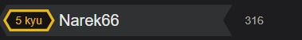

<h1 style="font-weight:600; color:white"> Hi there 👋, my name is Narek!</h1>

 

## 👨‍💻 About Me 

 

  
As a junior front-end developer, I have acquired a strong foundation in web development through my training at Smart Code. I possess skills in HTML, CSS, Sass, JavaScript, TypeScript, React, and Redux. With a solid understanding of these technologies, I am prepared to contribute to front-end development projects and collaborate with senior developers to create dynamic and user-friendly websites or web applications.

 

  <ul  style="color:white;">
        <li>🖥️ I like writing code.</li>
        <li>🗣️ I can speak Armenian, English, and Russian.</li>
        <li> 🔭I am currently looking for a job.</li>
    </ul>
    
 

## 💻 Technologies
 

  

 
  
  
  
  
  
 

##  🤝 Linkedin
 

## 💻 Codewars
 

 

